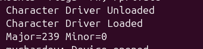
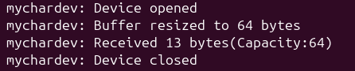
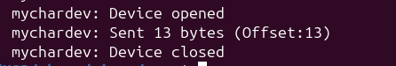
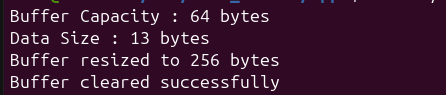

# Linux Character Driver

A Linux character device driver implemented using the `cdev` framework.

The driver creates a character device (`/dev/mychardev`) and allows user-space applications to communicate with the kernel using standard file operations (`read()`, `write()`) and custom `ioctl()` commands.

The project also includes user-space applications to test all supported driver operations.

---

# Architecture

```text
                    +----------------------------+
                    |     User Applications      |
                    |----------------------------|
                    |  write_app                 |
                    |  read_app                  |
                    |  ioctl_app                 |
                    +-------------+--------------+
                                  |
                    read / write / ioctl
                                  |
                                  v
+----------------------------------------------------------------+
|                    Linux Character Driver                       |
|----------------------------------------------------------------|
| File Operations                                                 |
|   • open()                                                      |
|   • read()                                                      |
|   • write()                                                     |
|   • unlocked_ioctl()                                            |
|   • release()                                                   |
|                                                                |
| Buffer Management                                               |
|   • Dynamic Kernel Buffer                                       |
|   • Automatic Buffer Resizing (krealloc)                        |
|   • Mutex Synchronization                                       |
|                                                                |
| ioctl Commands                                                  |
|   • CLEAR_BUFFER                                                |
|   • GET_BUFFER_SIZE                                             |
|   • GET_DATA_SIZE                                               |
|   • RESIZE_BUFFER                                               |
+----------------------------------------------------------------+
                                  |
                                  v
                    +----------------------------+
                    |    Dynamic Kernel Buffer   |
                    +----------------------------+
```

---

# Features

- Character device registration using the `cdev` framework
- Dynamic major and minor number allocation
- Automatic device node creation using `class_create()` and `device_create()`
- File operations
  - `open()`
  - `read()`
  - `write()`
  - `release()`
  - `unlocked_ioctl()`
- Dynamic kernel buffer using `krealloc()`
- Automatic buffer resizing
- Thread-safe access using mutexes
- Safe communication between user space and kernel space using:
  - `copy_from_user()`
  - `copy_to_user()`
- User-space applications for testing

---

# Supported ioctl Commands

| Command | Description |
|----------|-------------|
| `CLEAR_BUFFER` | Clears the kernel buffer |
| `GET_BUFFER_SIZE` | Returns the current kernel buffer capacity |
| `GET_DATA_SIZE` | Returns the amount of valid data stored |
| `RESIZE_BUFFER` | Resizes the kernel buffer |

---

# Project Structure

```text
linux-character-driver/
│
├── Makefile
├── README.md
│
├── include/
│   └── mychardev_ioctl.h
│
├── src/
│   └── char_driver.c
│
├── apps/
│   ├── Makefile
│   ├── write_app.c
│   ├── read_app.c
│   └── ioctl_app.c
│
└── Screenshots/
    ├── driver_load.png
    ├── write.png
    ├── read.png
    └── ioctl.png

```

---

# Build

Build the kernel module:

```bash
make
```

Build the user-space applications:

```bash
cd apps
make
```

---

# Usage

Load the driver:

```bash
sudo insmod char_driver.ko
```

Verify that the module is loaded:

```bash
lsmod | grep char_driver
```

Write data to the driver:

```bash
sudo ./write_app
```

Read data from the driver:

```bash
sudo ./read_app
```

Test the ioctl interface:

```bash
sudo ./ioctl_app
```

View kernel messages:

```bash
dmesg | tail
```

Unload the driver:

```bash
sudo rmmod char_driver
```

---

# Output Screenshots

## Driver Loaded



---

## Write Operation



---

## Read Operation



---

## ioctl Operations



---

# Driver Workflow

1. Load the kernel module using `insmod`.
2. The driver registers a character device and creates `/dev/mychardev`.
3. User-space applications open the device file.
4. Data is transferred between user space and the kernel using `read()` and `write()`.
5. Device-specific operations are performed using `ioctl()`.
6. The driver manages the kernel buffer using dynamic memory allocation and mutex protection.
7. The module is unloaded using `rmmod`.
