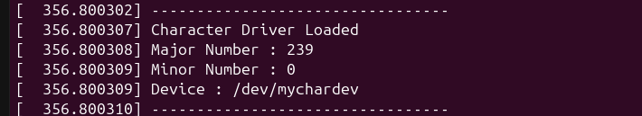
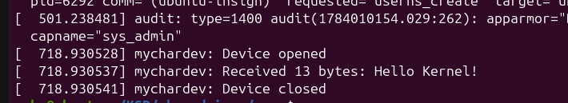

# Linux Character Driver

This is my first Linux device driver project.

I recently started learning Linux device driver development, and this project is my first step towards understanding how device drivers work inside the Linux kernel. Instead of only reading about the concepts, I wanted to build a simple character driver from scratch and understand the complete flow from user space to kernel space.

In this project, I implemented a basic character driver using the **cdev** framework. The driver creates a device node (`/dev/mychardev`) and supports basic **read** and **write** operations using a kernel buffer. I also wrote simple user-space applications to test the driver.

## What this project covers

* Character device registration
* Dynamic major and minor number allocation
* Creating a device node using `class_create()` and `device_create()`
* Implementing `open()`, `read()`, `write()` and `release()` callbacks
* Data transfer between user space and kernel space using `copy_from_user()` and `copy_to_user()`
* Basic user-space applications for testing the driver

## Project Structure

```text
linux-character-driver/
│
├── Makefile
├── README.md
├── src/
│   └── char_driver.c
└── apps/
    ├── Makefile
    ├── write_app.c
    └── read_app.c
```

## How to Build

Build the kernel module:

```bash
make
```

Build the user-space applications:

```bash
cd apps
make
```

## Testing

Load the driver:

```bash
sudo insmod char_driver.ko
```

Write data to the driver:

```bash
./write_app
```

Read data from the driver:

```bash
./read_app
```

View kernel messages:

```bash
dmesg | tail
```
## Driver Loaded

The module registers the character device, allocates a major number dynamically, and creates `/dev/mychardev`.



## Write Operation

The user-space application writes data to the kernel buffer using the driver's `write()` callback.



## Read Operation

The stored data is copied back to user space through the driver's `read()` callback.


This project helped me understand the basic lifecycle of a Linux character driver, how a device is registered with the kernel, how a device node is created, and how data is exchanged safely between user space and kernel space.

This repository will continue to evolve as I learn more about Linux device drivers. Some of the features I plan to add are:

* Better error handling
* Dynamic memory allocation
* `ioctl()` support
* Synchronization using mutexes
* Additional documentation and diagrams


